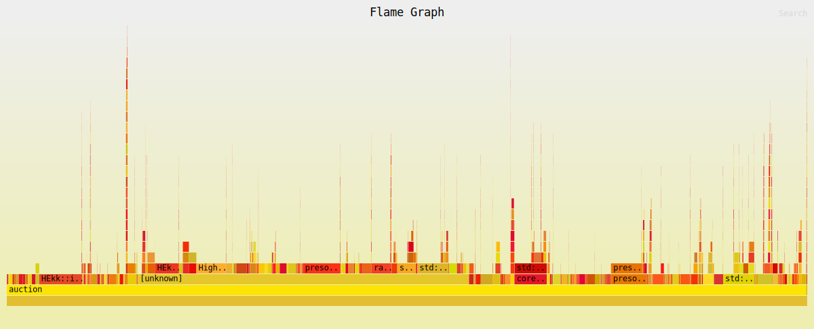

## Periodic Auction Matcher (Educational)

A systems-focused, educational implementation of a periodic batch auction matcher written in Rust.

This project explores low-latency matching infrastructure, LP-based clearing, and correctness-driven development. \
It is intentionally scoped as a learning and design exercise — not a production exchange.

# Overview

The system models a simplified periodic auction pipeline:

- Ingress → Sequencer → Scheduler → Matcher

- Time-based batch cutoffs (based on ingress timestamps)

- Atomic batch clearing

- Explicit latency measurement across stages

The architecture emphasizes determinism, separation of concerns, and performance transparency.

# Matching Engine

Two independent implementations are included:

- [`Reference`](src/engine/matcher/naive.rs) LP matcher – straightforward and easy to reason about using [`HiGHS`](https://highs.dev/) via the [`good_lp`](https://github.com/rust-or/good_lp) crate

- [`Incremental`](src/engine/matcher/stream/highs.rs) matcher – significantly faster, incrementally builds the LP model using the bindings to HiGHS directly via the [`highs-sys`](https://github.com/rust-or/highs-sys) crate

The purpose is to explore the trade-offs between clarity and performance in a real-time auction setting.

# Correctness & Verification

Correctness is treated as a primary design concern.

__Property-based testing__
Core economic [`invariants`](src/engine/matcher/stream/highs.rs#L670) are validated using proptest over randomly generated order books.

__Differential testing (work in progress)__
The project includes two matching implementations:

- A straightforward reference LP matcher

- A faster incremental matcher

Differential testing infrastructure is in place to compare both implementations under identical inputs.

Currently, tests may diverge in cases where the LP is underspecified (e.g., identical bid/ask prices leading to multiple valid optimal allocations). This highlights areas where additional tie-breaking constraints or stronger specifications are needed.

__Verification-Guided Development (Lean 4, aspirational)__ \
An aspirational extension of this project is to amend it to formalize core auction invariants in Lean 4 to support verification-guided development. The current implementation is not formally verified.


__Known limitations__:

- Orders where `bid_price == ask_price` are not matched correctly.

- Order cancellation, carry-forward of unmatched orders, persistence, and distributed scaling are intentionally not implemented.

This prototype focuses on understanding batching semantics, LP clearing, and latency behavior, not production completeness.

# Performance Observations (5k–20k orders)
__Benchmarking Environment__

- __CPU__: 11th Gen Intel(R) Core(TM) i5-1135G7 @ 2.40GHz (Turbo enabled, performance governor)

- __Cache__: 8MB L3 / 5MB L2

- __Memory__: 16GB LPDDR4 @ 4267 MHz

- __OS__: Ubuntu 24.04.4 LTS (Kernel 6.17.0)

- __Context__: CPU-pinned via `core_affinity` to minimize context switching.

__Latency Measurements__
| Component	| p50	  | p99	    | p99.9   | Max      |
|-----------|---------|---------|---------|----------|
| Ingress	| 488 ns  | 932ns   | 1.89 µs | 81.1 ms* |
| Sequencer | 45 ns   | 113 ns  | 239 ns  | 92.0 ms* |
| Matcher	| 31.9 ms | 47.5 ms | 91.8 ms | 91.8 ms  |

LP solving dominates runtime. Ingress and sequencing overhead are negligible relative to optimization cost.

*Note: Tail latencies in Ingress/Sequencer are driven by deterministic backpressure from the Matcher stage once the bounded buffers saturate.

__Profiling (Flamegraph)__
<details>
<summary>Click to view interactive Flamegraph</summary>



</details>

# Running the Prototype

You can try the engine with generated orders or run benchmarks:

```bash
# Run the engine with a test batch of generated orders
cargo run --release
```

```bash
# Run performance benchmarks
cargo bench
```

```bash
# Run the tests (unit, property-based, differential):
cargo test
```

The `--release` build ensures realistic timings for latency and matching behavior. Benchmarks exercise incrementally building the LP and clearing using 10k orders.
